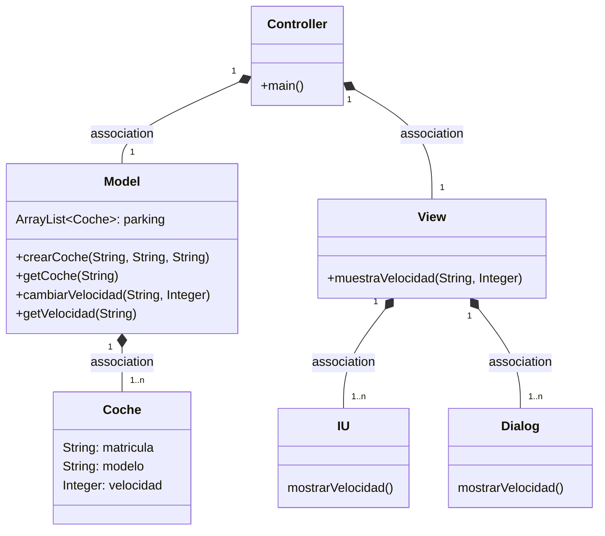
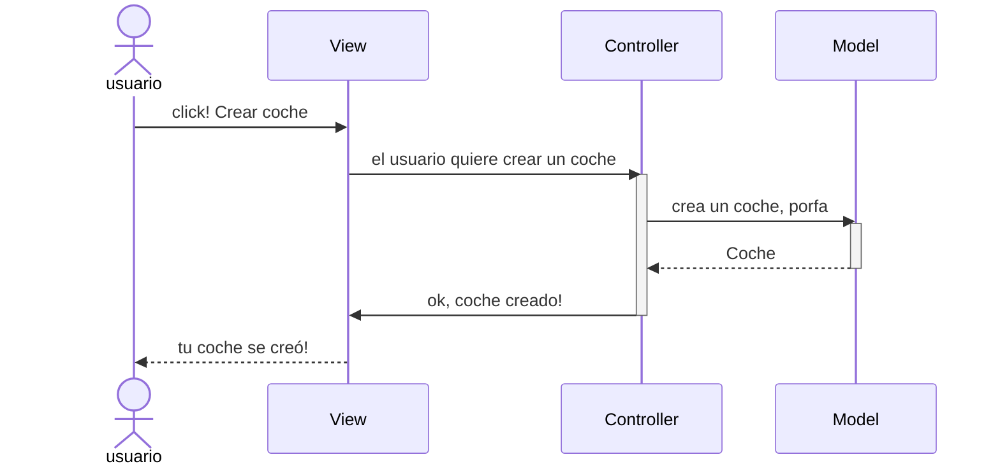
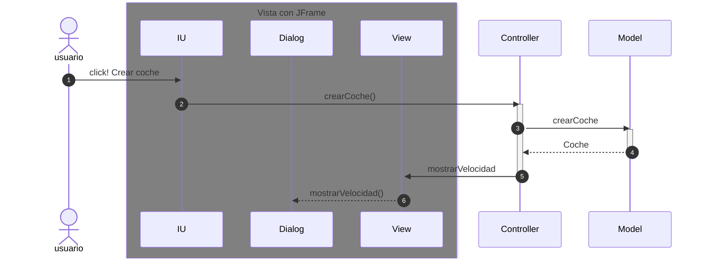
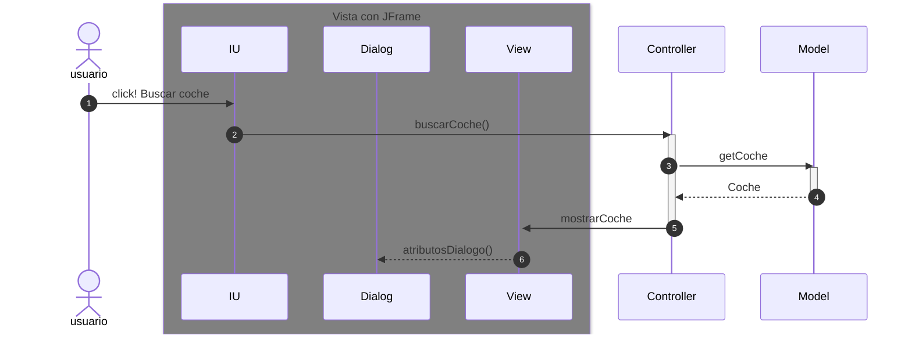

# Arquitectura MVC

Aplicación que trabaja con objetos coches, modifica la velocidad y la muestra

---

En esta rama está añadido los eventos en la IU

-----

## Diagrama de clases:

---

## Evento en el View

Cuando ocurre un evento en la vista, el `controller` se tiene que enterar.
Tenemos que tener en cuenta que en el MVC estricto, la vista no se comunica con el modelo.

En el listener del botón llamamos al `controller`

Ahora la parte de la Arquitectura de la vista, son tres clases

--------------

## EXAMEN 24/05/23

Previamente tuve que añadir a la rama angel_v3 los métodos aumentar/bajar
velocidad ya que no se subieron a GitHub en su momento. Desde esta
rama creo otra llamada 'ex3' que es donde incorporo el código solicitado
en el examen. Añado un commit puntualizando el principio de la tarea.

### Primera parte
> Los siguientes pasos se desencatenarán sólo después de accionarse el botón
> creado en `IU` el cual tiene un `actionPerformed()` que le pasa a `Controller`
> el texto del campo de la matricula.
1. En la clase `Controller` llamo a un método de la clase Model
para que me devuelva el coche que se pase por parámetro.
2. Una vez obtenido el objeto `Coche` buscado, se llama a un método de la 
clase que a su vez llama a un método de la clase `Dialog`. A este método
se le pasarán por parámetros los atributos del objeto que hemos recogido.
3. El método de la clase `Dialog` simplemente mostrará al usuario 
una ventanita con los
atributos del objeto buscado.
4. Se completa el _javadoc_ de los métodos y se hace un _commit_

### Segunda parte

