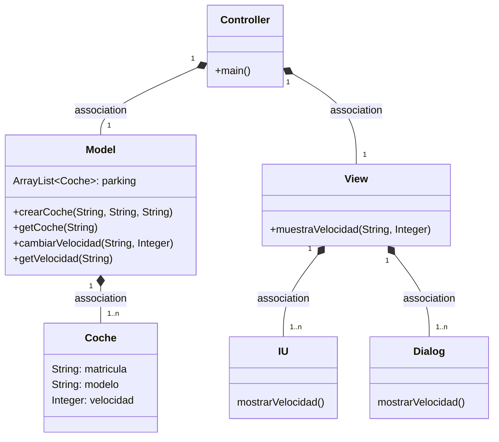
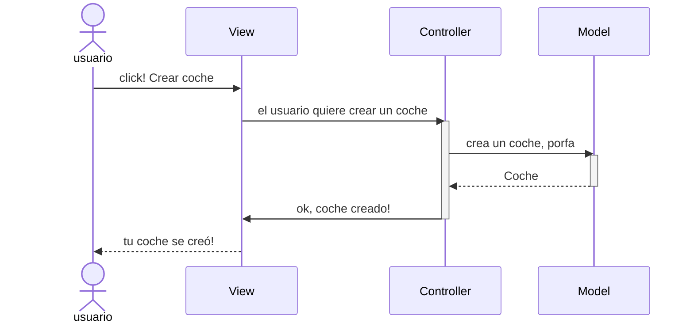
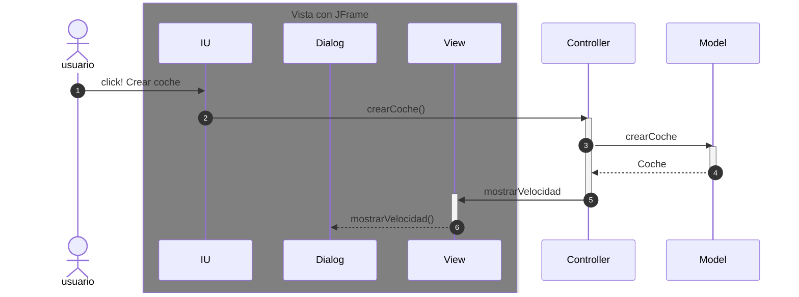

# Arquitectura MVC

Aplicación que trabaja con objetos coches, modifica la velocidad y la muestra

---

En esta rama está añadido los eventos en la IU

-----

## Diagrama de clases:



---

## Evento en el View

Cuando ocurre un evento en la vista, el `controller` se tiene que enterar.
Tenemos que tener en cuenta que en el MVC estricto, la vista no se comunica con el modelo.

En el listener del botón llamamos al `controller`




Ahora la parte de la Arquitectura de la vista, son tres clases



-----

# Examen 26/05/23 - Observer
_commit_ indicando el inicio del examen

## Observador
Creo la clase que va a observar llamada `ObsExceso`
```java
public class ObsExceso implements Observer { 
    @Override
    public void update(Observable o, Object arg) {

    }
}
```
Implementa la interfaz `Observer` por lo que hay que sobreescribir el implementar
obligatoriamente el método `update()`

## Observado - _subject_
La clase `Model` extiende de `Observable`.
Le añadimos al método `subirVelocidad()` de esa clase los métodos:
* `setChanged()`
* `notifyObservers()` pasando por parámetro el objeto de la clase que se ha modificado

## Observador
Sobreescribimos el método `update()` indicando al usuario una advertencia sólo si 
después de haber modificado la velocidad, esta supera los 120 km/h

## Controller
Instanciamos el Observer y lo met


