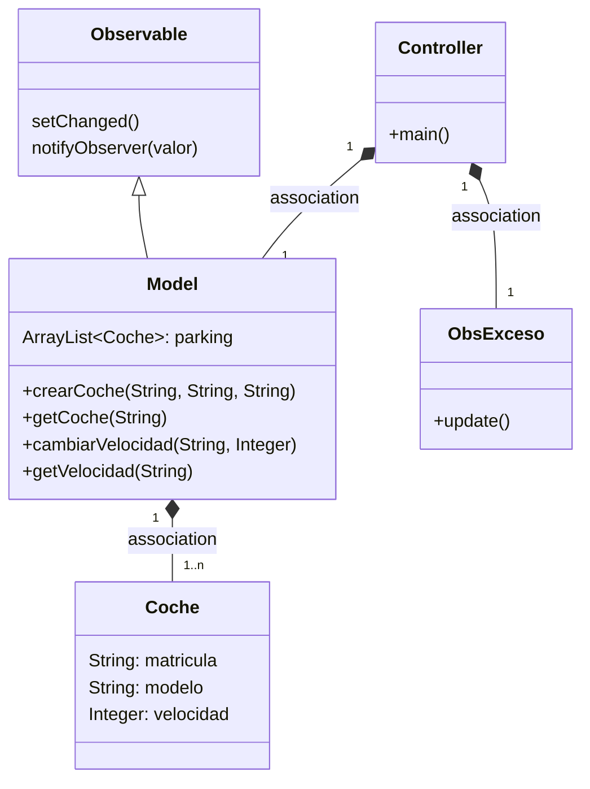
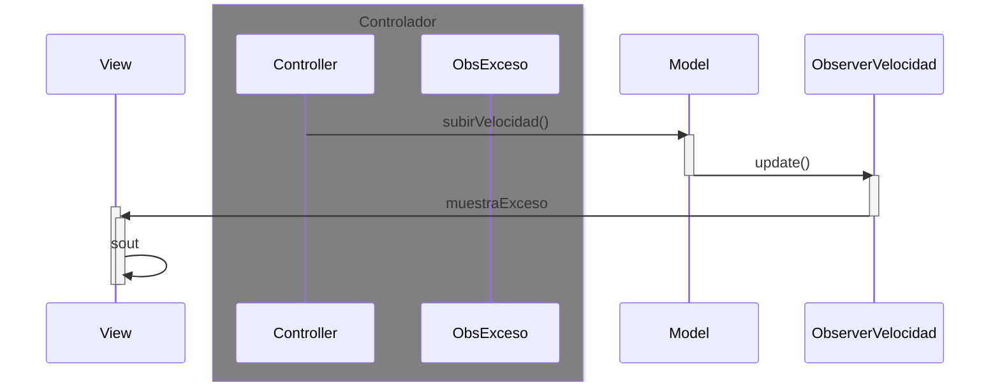

# Examen 26/05/23 - Observer
## Observer - Observalble
### Observador
Creo la clase que va a observar llamada `ObsExceso`.
```java
public class ObsExceso implements Observer { 
    @Override
    public void update(Observable o, Object arg) {

    }
}
```
Implementa la interfaz `Observer` por lo que hay que implementar
obligatoriamente el método `update()`, posteriormente se sobreescribirá.

### Observado - _subject_
Hago que la clase `Model` extienda de `Observable`.
Le añado al método `subirVelocidad()` los métodos:
* `setChanged()`
* `notifyObservers(arg)` pasando como "arg" el objeto de la clase (previamente modificado).

### Observador
Sobreescribimos el método `update()` añadiendo una condición de que si se 
cumple, llamará a un método de `View` para que muestre un mensaje de advertencia.

----
## Conservando MVC

### `View`
En `View` creo un nuevo método que, mediante la llamada a `vDialogo()`, conseguiré
mostrarle al usuario el mensaje de advertencia.

### `Controller`
Instancio el Observer `ObsExceso` y lo meto como argumento en 
`addObserver()` del objeto `Model`.

-----
## Diagrama de clases

### Diagrama de clases

### Diagrama de frecuencia



